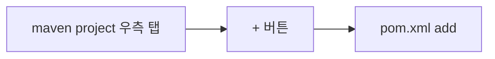
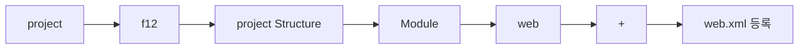
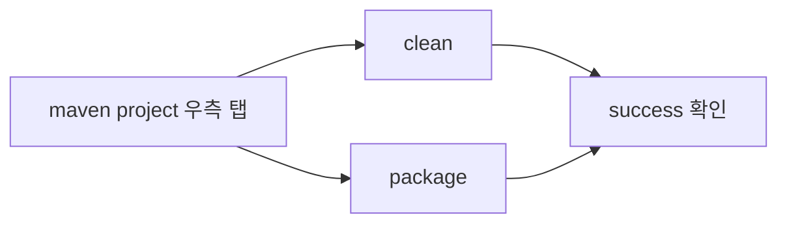
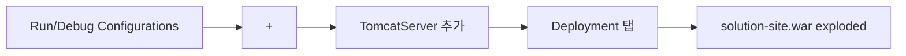

# Bizxpress Intellij Setting

지금부터 **Intellij** 에서 **bizxpress** 를 **setting**을 해보겠습니다.

##  empty project 생성

	project name : ...
	sdk : **1.7 (jav version 1.7.80)**
	projcet language level : 7 - Diamonds, ARM, multi-catch etc.
	Project compiler output : F:\test\out

## git 소스 다운

> git clone http://git.cyber-i.com/infra/solution-site.git

## module setting

    Module SDK : Project SDK 1.7
    Java EE version : Java EE 8
    Application Server : Tomcat 7.0.92
    Additional Libraries and Frameworks : Web Application(4.0)
    Version : 4.0
    [Next]
    Module name : solution-site
    Content root : F:\test\solution-site
    Module file location : F:\test\solution-site
    [Finish]

## pom.xml add

## web.xml add

## Clean, Package

## Tomcat Server

<!--stackedit_data:
eyJoaXN0b3J5IjpbLTIxMDE5NzM5MjVdfQ==
-->