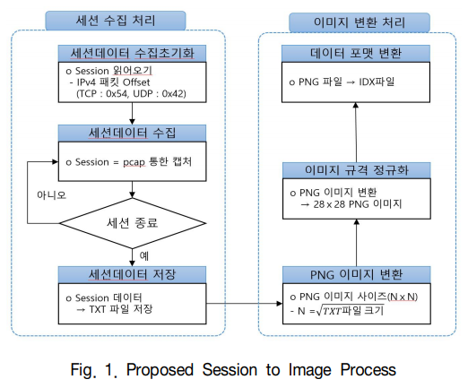
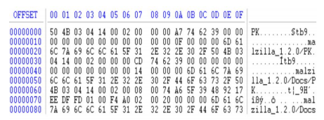
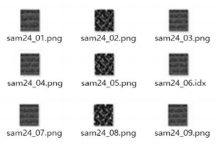
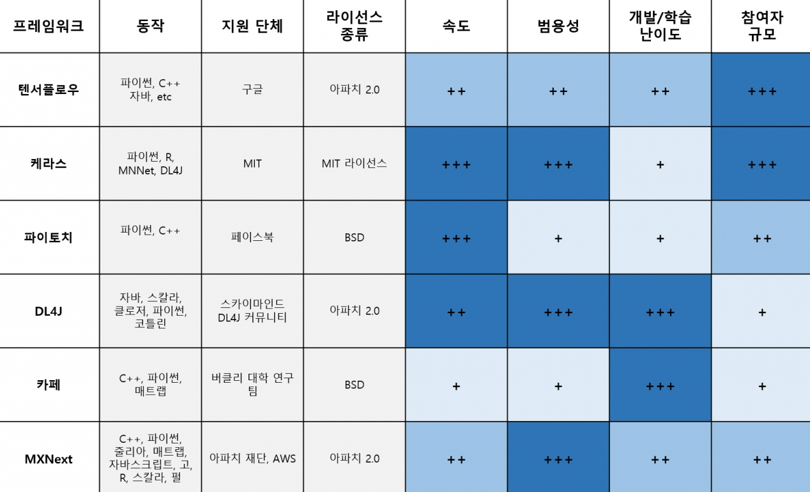

`2020.01.22`
`wjd0r@naver.com`

<select onchange="location.href=this.value">
 <option>home</option>
 <option value="https://wjd0r.github.io/">home</option>
</select>&nbsp;
<select onchange="location.href=this.value">
 <option>탐지 시스템</option>
 <option value="https://wjd0r.github.io/detecting/">탐지 시스템</option>
 <option>추가 예정</option>
</select>&nbsp;
<select onchange="location.href=this.value">
 <option value="">mysql install</option>
</select>

# 보안 기술 개발 동향


## 서론
```
최근 인공지능 기술의 발전에 힘입어 사이버 공격자들은 새로운 형태의 지능화된 알고리즘을 활용한 신·변종 사이버 공격과 자동화 기술을 활용하여 대규모의 사이버 보안 공격을 시도하고 있다. 이러한 추세에 힘입어 점점 고도화되고 다양해지는 사이버 공격에 효율 적으로 대응하기에는 기존의 보안 솔루션들은 많은 한계를 보이고 있다. 사이버 위협에 능동적으로 대비하기 위해서 보안 업계에서는 인공지능을 보안 분야에 적용하는 것에 주 목하고 있다. 보안이 인공지능과 결합하게 되면 네트워크, 위협 인텔리전스, 취약점 분석, 악성코드 분석, 실시간 탐지 및 대응 등 다양한 보안 분야에서 보안 능력이 획기적으로 향상될 것으로 예상되고 있다.
```
## 인공지능 보안 위협
```
인공지능 기술은 분명 현재의 보안 기술단계를 한 단계 끌어 올려, 이를 통해 안정적인 비즈니스 환경의 연속성을 보장해줄 뿐만 아니라, 효율적인 인력운용이 가능하다는 장점이 있다.
그러나 이러한 인공지능을 방어측의 전유물이라고 생각하면 큰 오산이다. 인공지능을 적용하여 창과 방패처럼 공격측과 수비측에 공평한 기회를 제공한다. 방어측에서 보면 인공지능이 다양한 악성코드의 공격 유형을 머신러닝 기법을 통해 자동으로 분류 및 분석하여 대응책을 마련하듯이 공격측에서도 현재 시스템이 가지고 있는 보안 취약점을 지속적으로 탐지하고 공격하여 보안의 허점을 찾아낸다. 또한, 공격자를 효과적으로 위장하는 데에도 사용될 수 있다.
```
## 네트워크 기반 침입탐지
```
네트워크 기반 침입탐지(Network-Based Intrusion Detection: NIDS)는 인가되지 않은 사용자가 정보자원에 불법으로 접근하거나, 정보자원을 고갈시키는 행위를 검출하고 이에 대처하는 것을 말한다.
현재 사용되고 있는 네트워크 기반 침입탐지 시스템의 상용제품 대부분은 각종 공격에 대한 특징(signature)을 분석하여 이것을 자동으로 감지할 수 있는 패턴형태로 만들어 놓고, 실시간으로 네트워크 패킷을 관찰하여 동일한 패턴이 발생하면 침입(Intrusion)을 알리는 오용탐지(Misuse Detection)가 주류를 이루고 있다. 이러한 방식은 비교적 높은 정확도를 보여주고 있으며, 실제 사용에서도 어느 정도 효율적이라고 할 수 있다. 그러나, 각종 공격(Attack)을 분석하여 패턴을 만들기 위해서는 해당 분야의 특별한 전문가(Expert)가 필요하기 때문에, 패턴의 생성과 유지보수에는 높은 비용이 요구된다. 또한, 이미 패턴이 존재하던 공격이 약간 우회하여 행해지면, 기존의 패턴만으로 새롭게 변형된 공격을 감지하기가 어렵다. 그러므로 전문가 기반의 오용탐지기법은 새로운 유형의 공격에 대해서는 매우 취약할 수밖에 없다.
오용탐지와는 다르게 평소 정상적인 네트워크 사용에 대한 각종 통계적인 자료를 만들어 놓고, 이 자료의 범위를 벗어나는 네트웍상의 트래픽(Traffic)이 발생하면 침입이 발생했다고 판단하는 통계적기반의 비정상 행위 탐지(Statistics-Based Anomaly Detection)기법도 있다. 이 방법은 일부 공격들에 대해서는 매우 효과적이지만, 공격이 단지 몇 개의 패킷으로 구성되어 있는 경우는 효율적이지 않다.
이러한 이유로 대부분의 상용 네트워크기반 침입탐지 시스템은 전문가에 의한 오용탐지를 주축으로 하고, 통계적 기반의 비정상 행위 탐지를 보조적으로 사용하고 있다. 그러나 이러한 방법들만으로는 다양한 유형의 공격을 완벽하게 탐지하기에는 한계가 있다.
이를 해결하기 위해 인공지능을 적용하면 정상적인 네트워크 패킷과 각종 비정상적인 네트워크 패킷을 수집하고, 이 패킷에 대해 다양한 머신러닝
```
##	데이터 전처리
```
기존 전통적인 보안 솔루션은 한계를 보이고 있고, 이를 위한 해결책이 인공지능 기술을 활용해야 한다는 것은 알겠는데, 그렇다면 “어떻게 보안에 인공지능을 적용을 할 것인가?” 라는 문제가 남는다.
인공지능의 기본 동작 원리는 수십 수백만 혹은 그 이상의 데이터들을 우선 학습을 하고, 학습을 통해 나온 컴퓨터가 계산한 알고리즘을 이용한다. 가령 고양이 사진과 고양이 사진이 아닌 것을 학습시킨 뒤, 한번도 보여주지 않은 사진을 보여주고 이것이 고양이 인지 아닌지의 판단은 학습을 통해 나온 알고리즘에게 물어보는 것이다.
정상적인 네트워크 패킷과 각종 비정상적인 네트워크 패킷을 수집하는 것이 첫번째 우선이 되어야 하며, 이 수집된 데이터들을 손실율을 줄이면서 딥러닝 알고리즘에 바로 적용할 수 있는 형태로 만들어져야 한다. 이를 데이터 전처리라고 하고, 전처리에 대한 방법은 아래와 같다.
```

```
우선 네트워크 트래픽을 pcap을 이용하여 세션 단위로 읽고 txt파일로 저장한다.
```

```
그렇게 나온 txt 저장된 데이터를 28 x 28 크기의 png 이미지로 이미지화 한다.
```

```
이런 과정으로 수집된 네트워크세션 데이터는 CNN, RNN, LSTM 등 다양한 딥러닝 알고리즘 등에 바로 적용해서 사용할 수 있다.
```
## 딥러닝 알고리즘 사용하기 위한 라이브러리
```
데이터가 준비가 되었다면, CNN, RNN, LSTM 등의 다양한 딥러닝 알고리즘에 적용을 해볼 수 있을 텐데, 이때 딥러닝에 필요한 수학적 기초나 딥러닝의 이론, 신경망 구조, 그리고 사용 방법을 모두 설명하기는 거의 책한권에 가까운 양이다.
여기서는 딥러닝 알고리즘에 적용하기 위한 주요한 딥러닝 라이브러리를 소개를 하고자 한다.
```

```
텐서플로우는 구글이 2015년 오픈소스로 공개한 뒤로, 다양한 자료와 범용성을 기반으로 가장 널리 사용되고 있다. 2016년 바둑에서 이세돌 9단을 꺾은 알파고에 텐서플로우가 적용됐다.
일본 금융사 SMFG개 개발한 신용카드 사기탐지 시스템이 텐서플로우로 제작이 되었다. GitHub에서 가장 많이 사용되는 딥러닝 프레임워크이기도 하다.

케라스는 모듈화, 최소주의, 확장성이 뛰어난데, 네이버페이의 카드결제 시스템 중 이상거래 감지 시스템에 케라스 딥러닝 기반으로 개선한 예가 있다.

파이토치는 페이스북 인공지능 연구팀이 만들었으며, 진입장벽, 유연성, 속도가 뛰어나다. 다만 자료와 예제를 구하는 것이 단점으로 꼽힌다.

Deeplearning4j 세계에서 가장 인기 있는 개발언어인 Java 로 만들어졌으나, 역시나 사용자 층이 깊지 않다. 일본의 AI 솔루션 기업 넥스트리머에서 이상거래탐지 연구에 활용된 바 있다.

Apapche MXNet은 아마존이 공식 지원하며, 폭넓은 언어 지원과 사용범위가 강점이다. C++, 스칼라, 줄리아, 매트랩, 자바스크립트, 클로저, 펄, R 등의 언어를 지원하여, 모바일 기기부터 서버 수준까지 지원한다. 
```
## 주요 네트워크 기반 침입탐지시스템

### 다크트레이스
```
모든 사용자 및 디바이스의 이상 징후를 머신러닝, 인공지능 기법을 활용하여 실시간으로 자동분석하고 그 이상여부를 판별, 차세대 위협 감지 솔루션

인간의 면역체계와 유사하게 단말, 서버 등 모든 디바이스에 대한 데이터 흐름을 통해서 정상행위를 학습하고 이에 위반하는 이상행위 판별
```
### 사이런스
```
기존에 수집된 악성코드의 특성을 다양한 머신러닝 알고리즘을 적용하여 학습하고, 이 학습한데이터를 기반으로 전혀 새로운 형태의 악성코드도 분류해 낼 수 있는 인공지는을 탑재

700만개 이상의 파일 특징을 0.1초 이내에 종합하여 분석
```
## 결론 및 시사점
```
최근 국내에서 열리고 있는 보안 컨퍼런스의 주제를 살펴보면, 인공지능 또는 머신러닝, 빅데이터 등이 70% 이상을 차지하고 있다. 이는 그만큼 현재 보안업계에서 인공지능에 대한 관심이 뜨겁다는 것을 보여주는 반증이라고 할 수 있다. 인공지능의 보안 분야 적용은 보안 시스템을 노리는 공격자와 방어자 모두에게 공평한 발전의 기회를 제공하고 있다.

과거의 사이버 공격은 뚜렷한 목적 없이 불특정 다수를 상대로 공격이 이루어진 것에 반해, 최근에는 금융, 교통과 전력 등 국민의 생명과 재산뿐만 아니라 국가 기반시설을 대상으로 정치, 경제적, 군사적 의도를 가지고 특정 대상을 공격하는 양상으로 변모하고 있다.

국가나 기관이 최신 보안 장비와 솔루션을 도입하여 운용하고 있고, 오랜 기간 노하우를 갖고 있음에도 불구하고, 날로 진화하는 공격을 실시간으로 막지 못해 피해를 입는 사례가 급속하게 증가하고 있으며, 때문에 인공지능의 도입은 필연이라 고 볼 수 있다.
```
## 참고
```
인공지능 기술 원리의 이해 / 송경빈

인공지능 기법을 이용한 네트워크기반 침입탐지 기술 동향 / 이창훈

인공지능을 활용한 보안기술 개발 동향 / 국경완, 공병철

인공지능 기술 및 산업 분야별 적용 사례 / 국경완

A Study of Data Preprocessing for Network Intrusion Detection based on Deep Learning / Kimoon Jeong

CNN과 RNN의 기초 및 응용 연구 / 이은주
```